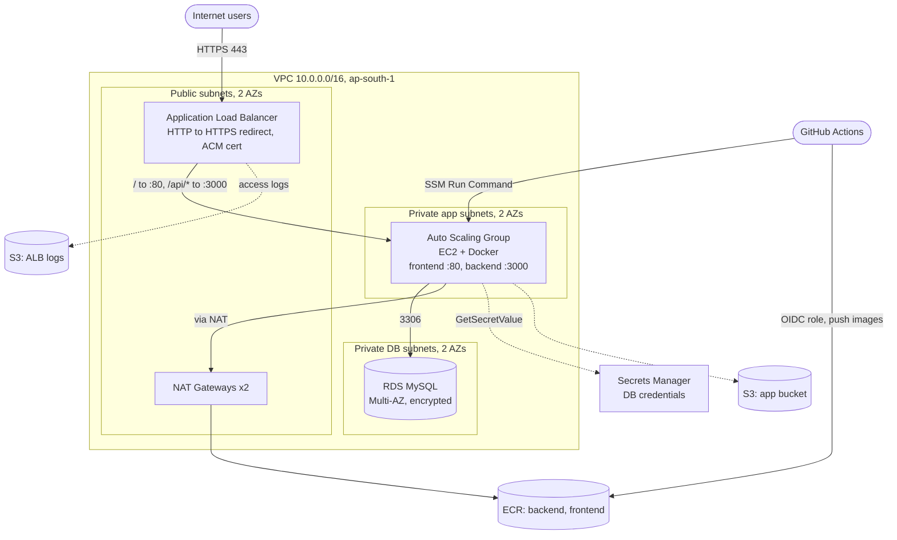

# DevOps Practical Task: AWS Infrastructure & CI/CD

A 3-tier web application (Nginx frontend, Node.js backend, MySQL) deployed on AWS with **Terraform** and **GitHub Actions**. Images are built in CI, pushed to **ECR**, and pulled onto EC2 instances in an Auto Scaling Group.

> **Status:** Solution design and codebase. `terraform fmt`, `validate` and `plan` all pass (**75 resources to add, 0 to change, 0 to destroy**). A live deployment was not required for this assessment.

## 1. Architecture



Traffic flow: **Internet, ALB (HTTPS), Auto Scaling EC2 instances, RDS MySQL**. The ALB also writes access logs to S3.

## 2. Repository layout

```
app/                       frontend (nginx), backend (Node/Express), database/init.sql
terraform/
  environments/dev/        root module (calls all modules, S3 backend)
  modules/
    vpc/                   VPC, public/private-app/private-db subnets, IGW, 2 NAT GWs, route tables
    security-groups/       ALB, App and RDS security groups
    iam/                   EC2 role + instance profile (least privilege)
    s3/                    app bucket and ALB logs bucket
    secrets-manager/       generated DB credentials
    rds/                   MySQL in private DB subnets
    alb/                   ALB, listeners, target groups, path routing, access logs
    asg/                   launch template, ASG, scaling policy, image-tag SSM parameter
    ecr/                   backend and frontend repositories
    github-oidc/           OIDC provider and CI roles
.github/workflows/
  terraform.yml            fmt, validate, plan; apply on main
  app-deploy.yml           build, push to ECR, deploy to EC2
```

## 3. CI/CD flow

```
git push -> GitHub Actions -> docker build -> push to ECR (tag = git SHA)
         -> update SSM parameter /<prefix>/image-tag
         -> SSM Run Command on instances -> each instance pulls from ECR and restarts containers
```

- **terraform.yml**: on pull request runs `fmt -check`, `init`, `validate`, `plan`. On push to `main` it also applies.
- **app-deploy.yml**: builds both images, pushes them to ECR tagged with the commit SHA, uploads `init.sql` to S3, updates the image-tag parameter, then deploys one instance at a time (`--max-concurrency 1`) so the others keep serving traffic. A health check runs at the end.
- New instances launched by Auto Scaling read the same SSM parameter, so scaling always uses the current image.
- **No AWS keys are stored in GitHub.** Workflows assume IAM roles through OIDC, restricted to this repository.

## 4. Deployment steps

**Prerequisites:** AWS CLI configured, Terraform >= 1.5, an ACM certificate ARN for your domain, and this repo on GitHub.

1. **State backend** (one-time): an S3 bucket `devops-aws-assessment-terraform-state` with encryption enabled.
2. **Configure variables:**
   ```bash
   cd terraform/environments/dev
   cp terraform.tfvars.example terraform.tfvars
   # set github_repo and certificate_arn
   ```
3. **Initial apply (local, once):** the CI roles are created by Terraform, so the first apply is manual.
   ```bash
   terraform init
   terraform plan -out=tfplan
   terraform apply tfplan
   ```
4. **Set GitHub repository variables** (Settings, Secrets and variables, Actions, Variables), using the Terraform outputs:
   `APP_DEPLOY_ROLE_ARN`, `TERRAFORM_ROLE_ARN`, `APP_BUCKET`, `CERTIFICATE_ARN`, and optionally `APP_URL`.
5. **Push to `main`.** The app workflow builds and deploys the application, and the Terraform workflow manages infrastructure from then on.
6. **Validate:** open `https://<domain>/health` (should return `{"status":"ok"}`) and check target health in the ALB console.

## 5. Security considerations

| Area | Implementation |
|---|---|
| Network | Three tiers: public (ALB, NAT), private-app (EC2), private-db (RDS). Only the ALB is internet-facing. |
| Security groups | Chained by reference: Internet, ALB SG, App SG, RDS SG. No CIDR-based rules between tiers. RDS has no egress rules. |
| Access | No SSH and no key pairs. Shell access is through SSM Session Manager only. |
| HTTPS | HTTP is redirected to HTTPS. TLS 1.3/1.2 policy on the listener, with an ACM certificate. |
| Secrets | DB password is generated by Terraform and stored in Secrets Manager. EC2 reads it at runtime, with no credentials in code or images. |
| IAM | EC2 role can read one secret, one SSM parameter, pull from the two ECR repos, and use the app bucket. CI app role can only push to ECR, set one parameter, and run SSM commands. |
| Encryption at rest | RDS (`storage_encrypted`), EBS volumes, S3 (KMS on the app bucket, SSE-S3 on the logs bucket because ALB log delivery does not support KMS). |
| S3 | Public access fully blocked, TLS-only bucket policies, versioning on the app bucket, 90-day lifecycle on logs. |
| EC2 | IMDSv2 required. Instances have no public IPs. |
| CI/CD | OIDC federation with short-lived credentials, trust restricted to this repository. |
| Images | ECR scan-on-push enabled. Immutable commit-SHA tags. |

## 6. High availability

- Subnets in two Availability Zones, one NAT Gateway per AZ.
- ALB spans both public subnets. The ASG spans both private-app subnets (min 2).
- RDS Multi-AZ with 7-day backups.
- ASG uses ELB health checks and replaces unhealthy instances. CPU target-tracking scaling at 60%.

## 7. Assumptions and design decisions

- **Domain and certificate:** ACM certificates need a domain. The ARN is an input variable, so a real certificate can be supplied without code changes. The plan was run with a placeholder.
- **Path-based routing:** the ALB sends `/` to the frontend target group (port 80) and `/api/*` and `/health` to the backend target group (port 3000).
- **Docker on EC2** instead of ECS, to match the assignment's EC2 Auto Scaling requirement.
- **Terraform CI role has AdministratorAccess** for simplicity. In production this would be scoped down to the services used.
- **`init.sql` runs on each deploy** and failures are tolerated. A migration tool (Flyway, Liquibase) would replace this in production.
- **Dev-friendly defaults:** `force_destroy` on buckets and ECR, secret recovery window of 0, RDS deletion protection off. These should be reversed for production.
- **NAT cost:** instances reach ECR and Secrets Manager through NAT Gateways. VPC endpoints would reduce cost and keep traffic on the AWS network.
- **State:** the DB password is in Terraform state, so the state bucket is encrypted and access-controlled.

## 8. Local development

```bash
cd app
docker compose up --build   # frontend on http://localhost:8080
```